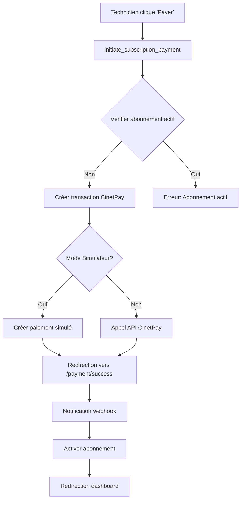

# 🎯 Guide Complet - Système de Paiement Côté Technicien

## 📋 **Vue d'ensemble**

Le système de paiement côté technicien permet aux techniciens de souscrire à un abonnement premium via CinetPay pour recevoir des demandes de réparation. Le système fonctionne en mode **simulateur** pour les tests et en mode **production** pour les vrais paiements.

---

## 🔧 **Configuration**

### **1. Settings Django (Backend/auth/settings.py)**

```python
# Configuration CinetPay
CINETPAY_API_KEY = os.getenv("CINETPAY_API_KEY", "1152009869685a9c56400b55.82198885")
CINETPAY_SITE_ID = os.getenv("CINETPAY_SITE_ID", "105899471")
CINETPAY_SECRET_KEY = os.getenv("CINETPAY_SECRET_KEY", "656493989685a9ce7af2bd8.69452364")
CINETPAY_ENVIRONMENT = os.getenv("CINETPAY_ENVIRONMENT", "TEST")
CINETPAY_USE_SIMULATOR = os.getenv("CINETPAY_USE_SIMULATOR", "True") == "True"

# Configuration CinetPay pour l'API
CINETPAY_CONFIG = {
    "API_KEY": CINETPAY_API_KEY,
    "SITE_ID": CINETPAY_SITE_ID,
    "SECRET_KEY": CINETPAY_SECRET_KEY,
    "ENVIRONMENT": CINETPAY_ENVIRONMENT,
    "USE_SIMULATOR": CINETPAY_USE_SIMULATOR,
    "API_URL": "https://api-checkout.cinetpay.com/v2/payment",
    "CURRENCY": "XOF",
    "LANG": "fr",
}
```

### **2. Mode Simulateur vs Production**

| Mode | Description | Utilisation |
|------|-------------|-------------|
| **Simulateur** | `CINETPAY_USE_SIMULATOR = True` | Tests, développement |
| **Production** | `CINETPAY_USE_SIMULATOR = False` | Vrais paiements |

---

## 🏗️ **Architecture du Système**

### **1. Modèles de Données**

#### **CinetPayPayment**
```python
class CinetPayPayment(models.Model):
    transaction_id = models.CharField(max_length=100, unique=True)
    amount = models.DecimalField(max_digits=10, decimal_places=2)
    status = models.CharField(choices=STATUS_CHOICES, default="pending")
    user = models.ForeignKey(settings.AUTH_USER_MODEL, on_delete=models.CASCADE)
    metadata = models.TextField(blank=True)  # JSON stringifié
    # ... autres champs
```

#### **TechnicianSubscription**
```python
class TechnicianSubscription(models.Model):
    technician = models.ForeignKey('Technician', on_delete=models.CASCADE)
    plan_name = models.CharField(max_length=100)
    start_date = models.DateTimeField()
    end_date = models.DateTimeField()
    is_active = models.BooleanField(default=True)
    payment = models.ForeignKey('CinetPayPayment', on_delete=models.SET_NULL, null=True)
```

### **2. Flux de Paiement**



---

## 🔄 **Endpoints API**

### **1. Initiation du Paiement**
```
POST /depannage/api/cinetpay/initiate_subscription_payment/
```

**Request:**
```json
{
    "duration_months": 1,
    "amount": 5000,
    "description": "Abonnement technicien"
}
```

**Response (Succès):**
```json
{
    "success": true,
    "payment_url": "http://localhost:5173/payment/success?transaction_id=TXN-ABC123&amount=5000&status=success",
    "transaction_id": "TXN-ABC123",
    "amount": 5000,
    "duration_months": 1,
    "message": "Paiement d'abonnement 1 mois initialisé avec succès"
}
```

**Response (Erreur - Abonnement actif):**
```json
{
    "success": false,
    "error": "Vous avez déjà un abonnement actif jusqu'au 15/01/2025. Vous ne pouvez pas souscrire à un nouvel abonnement tant que l'actuel est valide."
}
```

### **2. Notification Webhook**
```
POST /depannage/api/cinetpay/notify/
```

**Request (Simulateur):**
```json
{
    "transaction_id": "TXN-ABC123",
    "status": "ACCEPTED",
    "payment_token": "test_token_TXN-ABC123",
    "amount": 5000,
    "currency": "XOF",
    "metadata": "{\"user_id\": 1, \"duration_months\": 1, \"subscription_type\": \"technician_premium\"}"
}
```

**Response:**
```json
{
    "success": true,
    "message": "Abonnement activé avec succès"
}
```

### **3. Statut d'Abonnement**
```
GET /depannage/api/technicians/subscription_status/
```

**Response:**
```json
{
    "subscription": {
        "id": 1,
        "plan_name": "Standard 1 mois",
        "start_date": "2025-01-01T00:00:00Z",
        "end_date": "2025-02-01T00:00:00Z",
        "is_active": true
    },
    "can_receive_requests": true,
    "status": "active",
    "days_remaining": 15
}
```

---

## 🧪 **Tests et Simulation**

### **1. Script de Test**
```bash
python3 test_payment_complete.py
```

### **2. Test Manuel avec curl**

#### **Connexion:**
```bash
curl -X POST http://127.0.0.1:8000/users/login/ \
  -H "Content-Type: application/json" \
  -d '{"email": "ballo@gmail.com", "password": "bechir66312345"}'
```

#### **Initier un paiement:**
```bash
curl -X POST http://127.0.0.1:8000/depannage/api/cinetpay/initiate_subscription_payment/ \
  -H "Authorization: Bearer YOUR_TOKEN" \
  -H "Content-Type: application/json" \
  -d '{"duration_months": 1}'
```

#### **Simuler la notification:**
```bash
curl -X POST http://127.0.0.1:8000/depannage/api/cinetpay/notify/ \
  -H "Content-Type: application/json" \
  -d '{
    "transaction_id": "TXN-ABC123",
    "status": "ACCEPTED",
    "amount": 5000,
    "metadata": "{\"duration_months\": 1}"
  }'
```

---

## 🛡️ **Sécurité et Validation**

### **1. Prévention des Doubles Paiements**

```python
# Vérification avant création d'un nouveau paiement
active_subscription = TechnicianSubscription.objects.filter(
    technician=technician,
    end_date__gt=timezone.now(),
    is_active=True
).first()

if active_subscription:
    return Response({
        "success": False,
        "error": f"Vous avez déjà un abonnement actif jusqu'au {active_subscription.end_date.strftime('%d/%m/%Y')}."
    }, status=400)
```

### **2. Validation des Données**

```python
# Validation de la durée
duration_months = int(request.data.get('duration_months', 1))
if duration_months not in [1, 3, 6]:
    return Response({"error": "Durée invalide. Choisissez 1, 3 ou 6 mois."}, status=400)

# Validation du montant
base_amount = 5000
amount = base_amount * duration_months
```

### **3. Gestion des Erreurs**

```python
# Gestion des erreurs de connexion
except requests.exceptions.RequestException as e:
    logger.error(f"❌ Erreur de connexion à CinetPay: {str(e)}")
    return {
        "success": False,
        "error": "Erreur de connexion au service de paiement"
    }

# Gestion des erreurs de validation
except Exception as e:
    logger.error(f"❌ Erreur lors de l'initialisation CinetPay: {str(e)}")
    return {
        "success": False,
        "error": "Erreur interne du serveur"
    }
```

---

## 🎨 **Interface Utilisateur**

### **1. Composant SubscriptionPanel**

```typescript
const SubscriptionPanel: React.FC<SubscriptionPanelProps> = ({ technicianId }) => {
    const [selectedDuration, setSelectedDuration] = useState(1);
    const [processingPayment, setProcessingPayment] = useState(false);
    
    const handleRenewSubscription = async () => {
        // Appel API pour initier le paiement
        const response = await fetchWithAuth('/depannage/api/cinetpay/initiate_subscription_payment/', {
            method: 'POST',
            body: JSON.stringify({ duration_months: selectedDuration })
        });
        
        if (response.ok) {
            const data = await response.json();
            window.location.href = data.payment_url;
        }
    };
    
    return (
        <div>
            {/* Interface de sélection de durée */}
            {/* Bouton de paiement */}
        </div>
    );
};
```

### **2. Page de Succès**

```typescript
const PaymentSuccess: React.FC = () => {
    const [subscriptionStatus, setSubscriptionStatus] = useState(null);
    const [countdown, setCountdown] = useState(5);
    
    useEffect(() => {
        // Vérifier le statut d'abonnement
        // Rediriger automatiquement après 5 secondes
    }, []);
    
    return (
        <div>
            {/* Interface de confirmation */}
            {/* Compte à rebours */}
            {/* Bouton de redirection */}
        </div>
    );
};
```

---

## 📊 **Tarification**

| Durée | Montant | Description |
|-------|----------|-------------|
| 1 mois | 5 000 FCFA | Abonnement mensuel |
| 3 mois | 15 000 FCFA | Abonnement trimestriel |
| 6 mois | 30 000 FCFA | Abonnement semestriel |

---

## 🔍 **Débogage et Logs**

### **1. Logs Simulateur**
```
🔧 [SIMULATEUR] Paiement fictif initié
🔧 [SIMULATEUR] Paiement créé: TXN-ABC123 - 5000 FCFA
```

### **2. Logs Production**
```
🌐 [PRODUCTION] Appel API CinetPay réel
🌐 [PRODUCTION] Requête CinetPay: {...}
🌐 [PRODUCTION] Réponse CinetPay - Status: 200
```

### **3. Logs Notification**
```
🔔 [NOTIFICATION] Notification CinetPay reçue: {...}
🔔 [NOTIFICATION] Paiement TXN-ABC123 traité avec succès
🔔 [NOTIFICATION] Nouvel abonnement créé pour username
```

---

## 🚀 **Déploiement**

### **1. Mode Développement**
```bash
# Activer le simulateur
export CINETPAY_USE_SIMULATOR=True

# Démarrer le backend
./start_backend.sh

# Démarrer le frontend
cd Frontend && npm run dev
```

### **2. Mode Production**
```bash
# Désactiver le simulateur
export CINETPAY_USE_SIMULATOR=False

# Configurer les vraies clés CinetPay
export CINETPAY_API_KEY="votre_vraie_cle"
export CINETPAY_SITE_ID="votre_vrai_site_id"
export CINETPAY_SECRET_KEY="votre_vraie_cle_secrete"
```

---

## ✅ **Checklist de Validation**

- [ ] Configuration CinetPay dans settings.py
- [ ] Mode simulateur activé pour les tests
- [ ] Endpoints API fonctionnels
- [ ] Prévention des doubles paiements
- [ ] Gestion des erreurs
- [ ] Interface utilisateur responsive
- [ ] Logs de débogage
- [ ] Tests automatisés
- [ ] Documentation complète

---

## 🎯 **Résultat Final**

✅ **Système de paiement complet et fonctionnel**
- Paiements simulés en mode test
- Prévention des doubles paiements
- Interface utilisateur intuitive
- Gestion d'erreurs robuste
- Logs détaillés pour le débogage
- Documentation complète

Le système est prêt pour la production avec une simple modification de la configuration CinetPay ! 